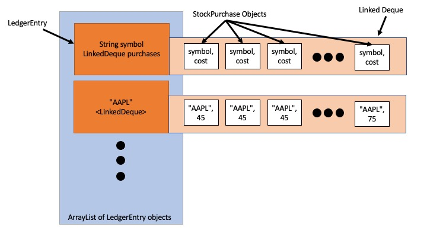

# Project 1: Capital Gains Tracker
**Purpose:** To practice and demonstrate proficiency in creating, manipulating and utilizing deques with maximum efficiency.

**Skills Used:** Java programming

**Knowledge Goals:** Deques

## Summary
In this project, you will assume the role of a software development consultant who has been hired to create a piece of software that will retain the gains and losses from purchasing and selling stocks. You will use an ArrayList and a Deque in this assignment. The Deque will be an ADT created by you (with some help from the code we used in class). You will have two packages: Deque and StockLedger. There will be two main parts to all projects: UML Class Diagram and Java Implmenetation.

### Part 1: UML Class Diagram
Create a UML class diagram of the project. Because our projects are not large in scope, these UML diagrams will sometimes be pretty simple. Use any of the UML creators I offered as options on Canvas. Please submit the UML Class Diagram as either PDF or image file such as JPG, PNG, etc. Please use the tutorial given in the Prelude of the book as an example.

### Part 2: Java Implementation

#### Interfaces and Classes
* Deque
    * **DequeInterface**
        * Interface for Deque (see below)
    * **LinkedDeque**
        * Class implementation for your Linked Deque.
        * Be aware: this contains two internal classes which has the following methods:
            * DLNode: class for the node of the deque.
                * getData
                * setData
                * getNextNode
                * setNextNode
                * getPreviousNode
                * setPreviousNode
            * IteratorForLinkedList: creates an Iterator type for the Deque **(You are required to use the Iterator class to traverse the Deque)**
                * next
                * hasNext
    * **EmptyQueueException**
        * Exception implementation to return if the deque is empty. 
* StockLedger
    * **StockLedgerInterface**
        * Interface for StockLedger (see below)
    * **StockLedger**
        * Class implementation of your stock ledger.
    * **LedgerEntry**
        * Class Implementation of an entry in your stock ledger.
    * **StockPurchase**
        * Class implementation of a purchase of stocks.
    * **Main**
        * Client interface

For this first project, you will be given the actual .java files for the interfaces but as we progress through the course, you will be given what will be in the interface and expected to write it yourself. The files can be found on the Modules page for this week. 

## Layout
The layout for the data structures are as follows:



## Output
All stocks of the same type will go into the same Linked Deque. The ArrayList will be implemented in StockLedger. You will need to write methods to display your ledger. You will need to use an Iterator. Note how DequeInterface extends Iterable<T>. Keep in mind where the data is that you need (StockPurchase class) and how you will access it. Be sure you maintain encapsulation and reusability of LinkedDeque. You should be able to use LinkedDeque for any deque, not just StockLedger content. This is one of the trickiest parts of this assignment so think it through, trace it out on paper, whatever you need to do.

When you print your Stock Ledger it should look like this, with the numbers changing as the program executes, of course.

```
---- Stock Ledger ----
AAPL: 45.0 (20 shares), 75.0 (20 shares) 
MSFT: 95.0 (20 shares) 
```

You will test your work by doing the following:

1. Buy 20 shares of AAPL at $45.
2. Buy 20 shares of AAPL at $75.
3. Buy 20 shares of MSFT at $95.
4. Display the ledger
5. Sell 30 shares of AAPL at $65
6. Display the ledger
7. Sell 10 shares of AAPL at $65
8. Display the ledger
9. Buy 100 shares of AAPL at $20
10. Buy 20 shares of AAPL at $24
11. Buy 200 shares of TSLA at $36
12. Display the ledger
13. Sell 10 shares of AAPL at $65
14. Display the ledger
15. Sell 150 shares of TSLA at $30
16. Display the ledger
17. Buy 5 shares of MSFT at $60
18. Buy 5 shares of MSFT at $70
19. Display the ledger
20. Sell 4 shares of MSFT at $30
21. Display the ledger
22. Sell 2 shares of MSFT at $30
23. Display the ledger

After all of this is done, you should have your final ledger display like this:

```
---- Stock Ledger ----
AAPL: 20.0 (90 shares), 24.0 (20 shares) 
MSFT: 95.0 (14 shares), 60.0 (5 shares), 70.0 (5 shares) 
TSLA: 36.0 (50 shares) 
```
With all the times we displayed the ledger, you should be able to follow along with how the stock transactions are occurring.


## Further Understanding
Let's discuss briefly what exactly is happening in the background with our first example:

1. ***Buy 20 shares of AAPL at $45.***
2. ***Buy 20 shares of AAPL at $75.***
3. ***Buy 20 shares of MSFT at $95.***

At this point, we have two Deques in our ArrayList. Deque 1 is AAPL and has 40 nodes in it. The first 20 are cost of $45 and the last 20 are $75. Deque 2 is MSFT and has 20 nodes in it that has cost of $95.

5. ***Sell 30 shares of AAPL at $65***

Now we sell 30 shares at $65. That is a total of $1950 that we got for selling them.

We will sell 30 of our shares and add up how much we paid for them. We sell them in order they were bought. So we sell all 20 of our $45 ones for a total of $900. We have to sell 10 more, so we sell 10 of our $75 ones for a total of $1650. From our initial selling we got $1950 so 1950-1650 = 300. We made a profit of $300! That is a gain. If our amount of our selling had been lower than the total cost of what we paid, our result would be in the negative and that would be a loss.

7. ***Sell 10 shares of AAPL at $65***

Now we sell our last 10 shares. We know we paid $75 a piece for them and we are only selling them at $65 so we are going to take a loss. 10 shares at $65 is $650. When we sell our 10 shares that cost us $75 originally they cost us $750. 650 - 750 = -100. We lost $100 in this sale.

## Some other items of importance
* Use javadoc comments on your functions to explain what they do. You do not have to do this in the class implementations where there is an interface, you can use @inheritDoc.
* Be sure your code is clean, legible and easy to read.
* Feel free to go above and beyond! Add new methods and functionality, test in different ways in addition to what you are required to do, be creative! The top grades go to those who go above and beyond. Strive for excellence.
* You are not required to create unit tests but are welcome to do so if you wish.
* Including the runtime as a comment on algorithms with loops in them will be seen as going above and beyond as well.

## Format Requirements
Please ensure you follow the structure as listed above. Use IntelliJ to do your work. Use javadoc comments where appropriate.
Ensure that your UML diagram submission is in PDF or an image file format.

## Assessment
Please see the Rubric on canvas for assessment.

## Deliverables
* Please add your UML documents to your Git repository. I will look for them there.
* Submit a link to your Git repository. If you make the repository private, make sure to add me as a collaborator, so I can see your code.